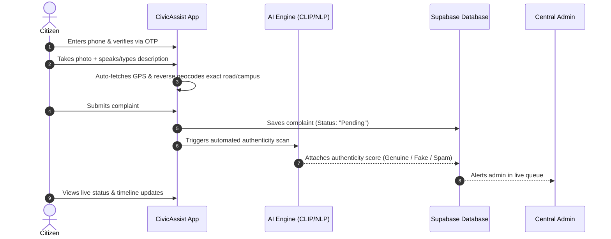
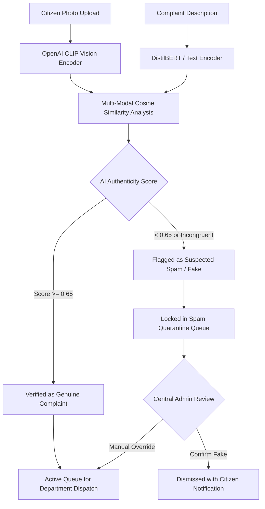
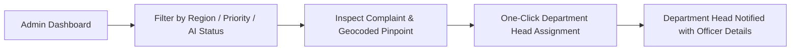
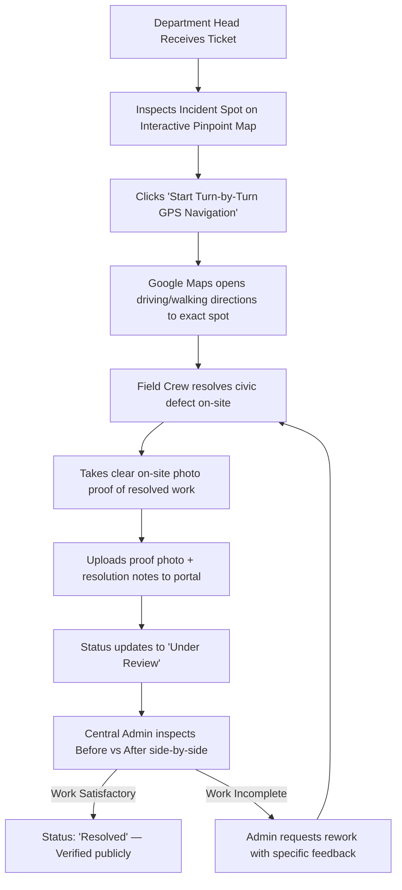

# 🏛️ CivicAssist — Workflows, Features & Innovation USPs

> **The Next-Generation AI-Driven Municipal Governance & Civic Accountability Platform**  
> *Engineered for High-Precision Citizen Reporting, Fraud Prevention, and Transparent On-Site Municipal Verification across Maharashtra.*

---

## 📑 Table of Contents
1. [Executive Summary & Vision](#-executive-summary--vision)
2. [The Core Problem vs. CivicAssist Solution](#-the-core-problem-vs-civicassist-solution)
3. [End-to-End System Workflows](#-end-to-end-system-workflows)
   - [Citizen Reporting & Tracking Workflow](#1-citizen-reporting--tracking-workflow)
   - [Dual-Model AI Authenticity & Fraud Prevention Engine](#2-dual-model-ai-authenticity--fraud-prevention-engine)
   - [Municipal Admin Dispatch & Quality Control Workflow](#3-municipal-admin-dispatch--quality-control-workflow)
   - [Field Officer On-Site Resolution & Proof Workflow](#4-field-officer-on-site-resolution--proof-workflow)
4. [Comprehensive Feature Matrix](#-comprehensive-feature-matrix)
   - [Citizen Web App Layer](#a-citizen-web-app-layer)
   - [Municipal Governance & Admin Dashboard](#b-municipal-governance--admin-dashboard)
   - [Department Head Field Execution Portal](#c-department-head-field-execution-portal)
   - [Geo-Spatial Heatmap & Regional Analytics Engine](#d-geo-spatial-heatmap--regional-analytics-engine)
   - [Bilingual AI Civic Copilot (English & Hindi)](#e-bilingual-ai-civic-copilot-english--hindi)
5. [Top 10 Unique Selling Propositions (USPs) for Hackathon Presentation](#-top-10-unique-selling-propositions-usps)
6. [Competitive Benchmark: CivicAssist vs. Traditional Systems](#-competitive-benchmark)
7. [Hackathon Pitch Deck & Demo Cheatsheet](#-hackathon-pitch-deck--demo-cheatsheet)

---

## 🎯 Executive Summary & Vision

Traditional municipal portals (like standard grievance apps) suffer from **three critical systemic failures**:
1. **Low Data Quality & Trolling**: Hundreds of spam, fake, irrelevant, or duplicate reports overwhelm municipal officers.
2. **"Ghost Closures" & Zero Accountability**: Tickets are marked "Resolved" without actual work being performed on-site, destroying citizen trust.
3. **Imprecise Location Data**: Reports say "Pimpri-Chinchwad" or "Alandi" with no exact coordinates, forcing field crews to wander aimlessly or drop the case.

**CivicAssist** transforms civic reporting from a broken suggestion box into a **high-precision, closed-loop operational pipeline**. Combining **Dual-Modality AI (OpenAI CLIP + NLP)**, **sub-meter GPS Pinpoint geocoding with 1-click Google Maps Navigation**, and a **Mandatory Before-vs-After Visual Verification Inspector**, CivicAssist bridges the accountability gap between citizens, central administrators, and department field teams.

---

## ⚡ The Core Problem vs. CivicAssist Solution

| Challenge in Traditional Portals | How CivicAssist Solves It | Technical Enabler |
| :--- | :--- | :--- |
| **Fake & Irrelevant Reports** (e.g. selfies, memes, unrelated images) | **Automated AI Authenticity Screening** detects mismatch between image and description in real-time. | OpenAI CLIP Vision Embeddings + DistilBERT Text Relevance Model |
| **Ghost Ticket Closures** (staff marking resolved without work) | **Closed-Loop Resolution Proof Inspector**: Department must upload on-site photographic proof; Central Admin and citizens visually inspect Before vs. After photos. | Cloudinary Cloud CDN + Strict Role-Based Approval Architecture |
| **Vague Locality Coordinates** (e.g. broad district radius) | **Micro-Precision Pinpoint Geocoding**: Captures building, campus, and road names (e.g. *MIT Alandi, Dehu - Alandi Road*) with exact latitude/longitude. | Nominatim Reverse Geocoding + Leaflet Marker Engine |
| **Field Crews Unable to Locate Site** | **1-Click Turn-by-Turn GPS Navigation**: Directly opens Google Maps directions to the exact 6-decimal coordinates (`±5m`). | Dynamic URL Deep-Linking (`google.com/maps/dir/?api=1&destination=lat,lng`) |
| **Fragmented Regional Visibility** | **State-Wide Dynamic Civic Heatmap**: Multi-region visualization covering Maharashtra, Pune/PCMC, and Mumbai MMR with live density scaling. | Leaflet Vector Layers + Live Supabase Aggregation |
| **Language & Accessibility Barrier** | **Bilingual AI Civic Copilot**: Real-time voice speech-to-text and instant help in both English and Hindi. | Web Speech API + Intelligent Localized Language Context |

---

## 🔄 End-to-End System Workflows

### 1. Citizen Reporting & Tracking Workflow

### 2. Dual-Model AI Authenticity & Fraud Prevention Engine

### 3. Municipal Admin Dispatch & Quality Control Workflow

### 4. Field Officer On-Site Resolution & Proof Workflow

---

## 📦 Comprehensive Feature Matrix

### A. Citizen Web App Layer
- **Instant Phone OTP Authentication**: Secure zero-friction login via 6-digit SMS OTP without requiring complex passwords.
- **Micro-Precision Pinpoint Map Picker**: Draggable Leaflet pin allowing citizens to pinpoint the exact pothole or garbage dump within meters.
- **Sub-Building Reverse Geocoding**: Automatically extracts road, street, campus, and landmark names (e.g. *MIT Alandi, Dehu - Alandi Road*) instead of vague administrative zones.
- **Voice Speech-to-Text Reporting**: Allows citizens to speak their issue in their natural language, auto-populating the description field.
- **Interactive Community Feed**: Upvote/support neighborhood reports, contribute comments, and foster civic solidarity.
- **Transparent Public Timeline**: Every action (reported, scanned by AI, assigned to officer, proof uploaded, verified) is logged with exact timestamps.
- **Before-vs-After Public Inspector**: Citizens can inspect the original photo side-by-side with the official resolution proof photo submitted by the department.
- **Civic Leaderboard & Gamification**: Rewards responsible citizens with civic reputation points, badges, and recognition.

### B. Municipal Governance & Admin Dashboard
- **Central Incident Command Center**: Real-time overview of state-wide complaints with dynamic metrics (Total, Pending, In Progress, Under Review, Resolved, Fake/Spam).
- **Interactive Leaflet Pinpoint Map**: Embedded high-zoom map (`zoom=17`) showing the exact incident coordinates with custom high-contrast Civic Pinpoint markers.
- **1-Click Turn-by-Turn GPS Navigation**: Prominent **"Start Google Maps Navigation"** button linking directly to `google.com/maps/dir/?api=1&destination=lat,lng` for seamless field team routing.
- **Smart Departmental Dispatch**: Pre-mapped departments (Solid Waste Management, Roads & Potholes, Street Lighting, Water Supply, Sewerage, etc.) with dedicated officers and direct calling.
- **AI Moderation & Spam Quarantine**: Inspect AI confidence scores; manually override or officially reject fake complaints so citizens receive transparent feedback.
- **Resolution Proof Quality Verification**: Approve verified field work or reject substandard repairs with written rework instructions.

### C. Department Head Field Execution Portal
- **Role-Based Access Control (RBAC)**: Department heads (e.g. Solid Waste, Roads) only see complaints relevant to their jurisdiction or assigned to their name.
- **Field Route Guidance**: Direct access to decimal coordinates (`lat.toFixed(6), lng.toFixed(6)`) with quick copy and satellite map view.
- **Resolution Proof Upload Portal**: Mobile-responsive photo upload for field crews directly capturing site completion evidence.
- **Feedback & Rework Handling**: Immediate notification if Central Admin requests rework, showing specific feedback from the administrator.

### D. Geo-Spatial Heatmap & Regional Analytics Engine
- **Multi-Region State-Wide Heatmap**: One-click toggling between **All Maharashtra**, **Pune / PCMC**, and **Mumbai MMR**.
- **Dynamic Density Scaling**: Clusters issues dynamically from live database queries, adjusting hotspot radius and color indicators (Critical Red, High Orange, Moderate Yellow, Low Green).
- **Area-Wise Issue Severity Ranking**: Identifies municipal wards and localities with high civic distress to guide long-term infrastructure budgeting.

### E. Bilingual AI Civic Copilot (English & Hindi)
- **Real-Time Natural Language Help**: Citizens can ask questions like *"How do I report a pothole?"* or *"कचरा शिकायत कैसे करें?"*.
- **Emergency Helpline Directory**: Quick access to municipal helpline numbers (BMC, PCMC, Pune Municipal Corporation, Police, Ambulance, Women's Helpline).
- **Floating Quick-Action Widget**: Accessible on every screen with instant answers and voice dictation.

---

## 🏆 Top 10 Unique Selling Propositions (USPs)

### 1. 🛡️ Zero-Trust Civic Reporting (Dual-AI Fraud Guard)
Unlike conventional platforms where trolls can upload arbitrary images to clog queues, CivicAssist uses **OpenAI CLIP vision-language embeddings** paired with NLP to calculate semantic alignment between image and text. Spam and fake reports are quarantined before municipal resources are wasted.

### 2. 📸 Closed-Loop Visual Proof Verification (Eliminating "Ghost Closures")
The single biggest grievance citizens have with government portals is tickets being marked "Resolved" without any actual work done. CivicAssist enforces a **strict two-phase photographic proof requirement**:
1. Field Officer must photograph the completed site.
2. Central Admin must visually compare Before vs. After photos to sign off.
3. The comparison is made publicly transparent on the citizen's timeline.

### 3. 🎯 Sub-Meter GPS Precision & 1-Click Turn-by-Turn Field Navigation
Civic workers often fail to locate defects due to vague addresses. CivicAssist captures decimal GPS coordinates (`18.675000° N, 73.892000° E`) and provides field officers with an immediate **"Start Turn-by-Turn GPS Navigation"** button linking directly to Google Maps.

### 4. 🗺️ Multi-Regional Dynamic Heatmap with Live Analytics
Rather than hardcoded static heatmaps, CivicAssist dynamically aggregates live database issues across **Maharashtra (Mumbai MMR, Pune & PCMC)**, adjusting visual hotspots, issue density rankings, and category breakdowns in real time.

### 5. 🏛️ Strict Separation of Duties (Admin vs. Field Department)
Department heads cannot self-certify their own work as "Resolved." They can only submit resolution proof, placing the ticket into **"Under Review."** Only the independent Central Administrator has the authority to verify the work and officially close the ticket.

### 6. 🗣️ Multi-Modal & Bilingual Accessibility
Accessibility is paramount for inclusive governance. CivicAssist features voice speech-to-text dictation and full bilingual capabilities (English + Hindi) across the interface and AI assistant.

### 7. 📈 Community Crowdsourced Priority Signals
Citizens can upvote and support existing neighborhood complaints. Complaints with high citizen backing automatically gain elevated priority flags, signaling municipal administrators to dispatch emergency teams faster.

### 8. ⏱️ 100% Immutable Public Audit Timeline
Every action—submission, AI score generation, department routing, field proof upload, admin sign-off—is logged on an immutable public activity timeline, ensuring transparency and citizen trust.

### 9. ⚡ Lightweight, Serverless & Production-Ready Stack
Built on React 18, Vite, Supabase PostgreSQL, Node.js Express, and Cloudinary. Zero heavy legacy database dependencies, sub-second response times, and production build readiness.

### 10. 🔄 Automated Coordinate & Vicinity Fallback Engine
Even when citizens submit complaints without device GPS permissions, CivicAssist's intelligent geocoding engine infers locality centroids and neighborhood zones (e.g., Alandi, Kothrud, Bandra, Dharavi) to ensure every complaint is mapped without error.

---

## 📊 Competitive Benchmark

| Feature / Metric | CivicAssist | Traditional Municipal Apps (e.g. Swachhata / Aaple Sarkar) | Basic Hackathon CRUD Projects |
| :--- | :---: | :---: | :---: |
| **AI Fake/Spam Moderation** | ✅ **Yes** (CLIP Multi-Modal AI) | ❌ Manual review only | ❌ None |
| **Mandatory On-Site Proof Photo** | ✅ **Yes** (Before vs After Inspector) | ⚠️ Text note only or optional photo | ❌ Status dropdown only |
| **Independent Closure Approval** | ✅ **Yes** (Admin verifies Dept proof) | ❌ Dept self-closes | ❌ Single role toggle |
| **1-Click Field GPS Navigation** | ✅ **Yes** (Google Maps turn-by-turn) | ❌ Text address only | ❌ None |
| **Precise Landmark Geocoding** | ✅ **Yes** (Campus/Road level) | ⚠️ Pincode/Ward level | ❌ Raw input |
| **Multi-Region Live Heatmap** | ✅ **Yes** (Mumbai + Pune/PCMC) | ⚠️ Static PDF or delayed batch | ❌ Static dummy pins |
| **Bilingual Voice Copilot** | ✅ **Yes** (English + Hindi voice AI) | ❌ Static FAQ pages | ❌ English only |
| **Public Transparency Timeline** | ✅ **Yes** (Audit trail visible to all) | ⚠️ Limited status pills | ❌ Basic status |

---

## 🎤 Hackathon Pitch Deck & Demo Cheatsheet

### The 30-Second Elevator Pitch
> *"Civic complaints today are broken in two ways: government officers waste 40% of their time on fake or vaguely located reports, while citizens lose faith when tickets are marked 'Resolved' without actual work being done. CivicAssist fixes this with an intelligent, closed-loop platform: Dual-model AI screens out spam, micro-precision geocoding navigates field officers directly to the spot via Google Maps, and mandatory before-and-after photo verification ensures no ticket is ever closed without proof."*

### 2-Minute Live Demo Flow
1. **The Citizen Experience (15s)**: Show reporting a garbage complaint at *MIT Alandi*. Highlight automatic road-level address resolution and GPS pinpointing.
2. **The AI Guard (15s)**: Show the AI Authenticity analysis score confirming the report is genuine (or flagging an unrelated test image as spam).
3. **The Central Command (30s)**: Open the Mumbai Central Admin Dashboard. Show the live **Maharashtra Civic Heatmap** toggling between Pune and Mumbai. Open the complaint to view the pinpoint map.
4. **Field Navigation (20s)**: Click **"Start Turn-by-Turn GPS Navigation"** to demonstrate how field teams get routed directly to the exact coordinates.
5. **Resolution Verification (40s)**: Log in as Department Head, upload the on-site resolution photo. Switch back to Admin to inspect the **Before vs. After side-by-side inspector**, approve the resolution, and show the citizen's updated public timeline.
