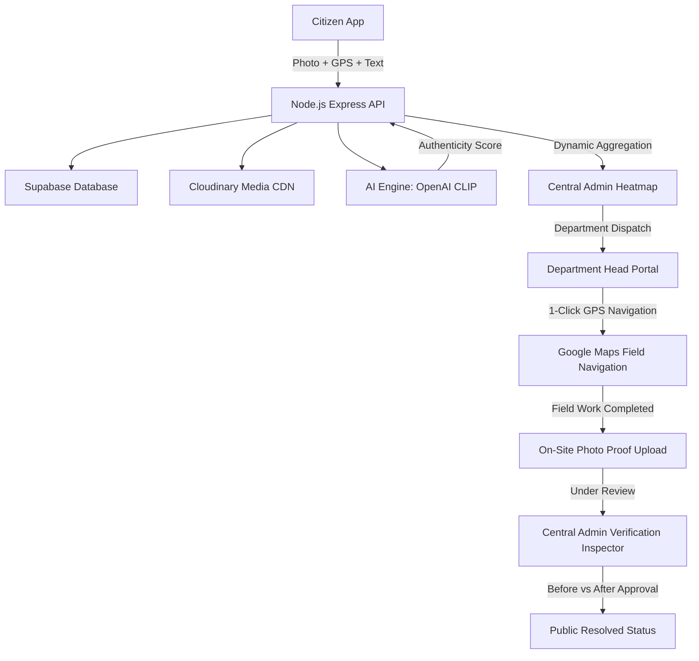

# Slide 04: Technical Approach (DevVortex)
*MIT ACSC • ALANDI, PUNE | Kurukshetra 2.0 Hackfest*

---

### 🔲 TOP-LEFT BOX: Technology Stack

* **Languages, Frameworks & Libraries:**
  * **Languages:** JavaScript (ES6+), Python 3.10+, SQL, HTML5, CSS3.
  * **Frontend:** React 18, Vite (Fast HMR & build), Tailwind CSS, Leaflet & React-Leaflet.
  * **Backend:** Node.js, Express.js (RESTful API architecture, Multer file stream).
  * **Voice & UI:** Web Speech Recognition API (Speech-to-Text), FontAwesome Pro icons.

* **Databases, APIs & Cloud Services:**
  * **Database:** Supabase (Cloud PostgreSQL with instant query indexing).
  * **Cloud Media Storage:** Cloudinary CDN (secure storage for complaints & resolution proofs).
  * **Geospatial & Navigation:** OpenStreetMap Tiles, Nominatim Reverse Geocoding (`zoom=18`), Google Maps Turn-by-Turn Deep Links.
  * **Authentication:** Phone SMS OTP Verification (zero-friction citizen onboarding).

* **AI / ML Models:**
  * **Vision-Language Model:** OpenAI CLIP (`ViT-B/32`) via PyTorch for cross-modal image-text semantic alignment.
  * **NLP Model:** HuggingFace Transformers (DistilBERT) for text intent, category classification, and spam confidence scoring.

---

### 🔲 BOTTOM-LEFT BOX: Working / Implementation Approach

* **System Workflow (Input to Output):**
  1. **Capture & Geocode (Input):** Citizen snaps a photo, speaks/types a description; GPS auto-resolves to sub-building precision (*e.g. MIT Alandi, Dehu - Alandi Road*).
  2. **AI Authenticity Scan:** Persistent Python AI engine runs multi-modal CLIP scoring. If semantic similarity is $\ge 0.65$, issue is verified as genuine; otherwise flagged into spam quarantine.
  3. **Municipal Triage & Dispatch:** Central Admin inspects regional density on the Maharashtra Heatmap and assigns the ticket to the relevant Department Head.
  4. **GPS Field Routing:** Officer taps *"Start Turn-by-Turn Navigation"* launching Google Maps directly to the exact 6-decimal coordinates (`±5m`).
  5. **Verified Resolution (Output):** Field crew uploads on-site photo proof; Central Admin validates Before vs. After photos side-by-side before closing the ticket publicly.

* **Key Modules & Interaction:**
  * **Citizen Portal:** Voice-enabled client communicating via JSON & FormData to REST endpoints.
  * **AI Microservice:** Asynchronous background worker computing cosine similarity without blocking HTTP requests.
  * **Central Admin Engine:** Live multi-region heatmap and two-tier RBAC approval system.

---

### 🔲 RIGHT TALL BOX: System Architecture / Technical Flow Diagram

#### Clean Diagram for PPT Slide:

```text
┌─────────────────────────────────────────────────────────────┐
│                       CITIZEN LAYER                         │
│   [Mobile / Web App]  ──►  [Voice Input]  ──►  [GPS Pin]    │
└──────────────────────────────┬──────────────────────────────┘
                               │ HTTPS / REST API
┌──────────────────────────────▼──────────────────────────────┐
│                    NODE.JS EXPRESS BACKEND                  │
│       [Auth & OTP]  │  [Issue Router]  │  [Admin API]       │
└──────────────┬───────────────────────────────┬──────────────┘
               │                               │
       ┌───────▼────────┐             ┌────────▼────────┐
       │   AI ENGINE    │             │ CLOUD STORAGE & │
       │ (Python/PyTorch│             │    DATABASE     │
       │   CLIP + NLP)  │             │ ─────────────── │
       │  Authenticity  │             │   Supabase DB   │
       │     Score      │             │  Cloudinary CDN │
       └───────┬────────┘             └────────┬────────┘
               │                               │
┌──────────────▼───────────────────────────────▼──────────────┐
│                  MUNICIPAL GOVERNANCE LAYER                 │
│                                                             │
│   ┌───────────────────────────┐ ┌─────────────────────────┐ │
│   │   Central Admin Portal    │ │   Department Portal     │ │
│   │  - Maharashtra Heatmap    │ │  - 1-Click Google Nav   │ │
│   │  - Spam Quarantining      │ │  - On-Site Field Work   │ │
│   │  - Before/After Approver  │ │  - Proof Photo Upload   │ │
│   └───────────────────────────┘ └─────────────────────────┘ │
└─────────────────────────────────────────────────────────────┘
```

#### Mermaid Code (Optional for Interactive Previews):

